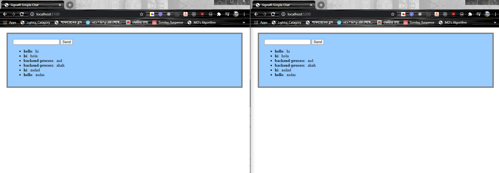

# SampleMessageBus
Sample applications to see how `RabbitMQ` message bus , `Mass Transit` and `SignalR` works. 

## Requirements ##

A message broker. This sample provides a docker-compose.yml which uses RabbitMq (broker) and MsSql (db). If you have rabbitMq locally installed, you can skip the first step.

## Easy Steps For SignalRChat ##

1. in the directory with the docker-compose.yml run the command `docker-compose up -d`
2. After complete, give it a few seconds, and you can browse to  http://localhost:15672, and view the rabbitmq management console
3. go into the SampleSignalR.Service/ directory and type  `dotnet run --console`
4. in another command window, go into SampleSignalR.Mvc and type `dotnet run --launch-profile sample1`
5. in a thihrd command window, go into SampleSignalR.Mvc and type `dotnet run --launch-profile sample2`
6. Browse to http://localhost:5100
7. In another browser tab, go to http://localhost:5200

## Message from one tab to another, and console app ##

ScreenShot :  

## For MassTransit ##

1. Open `MassTransitBasics.sln` 
2. First run `MassTransit.Receiver`  to register the consumer then run `MassTransit.Publisher` to publish message to RabbitMq.
 For more info visit https://dotnetcodr.com/messaging/